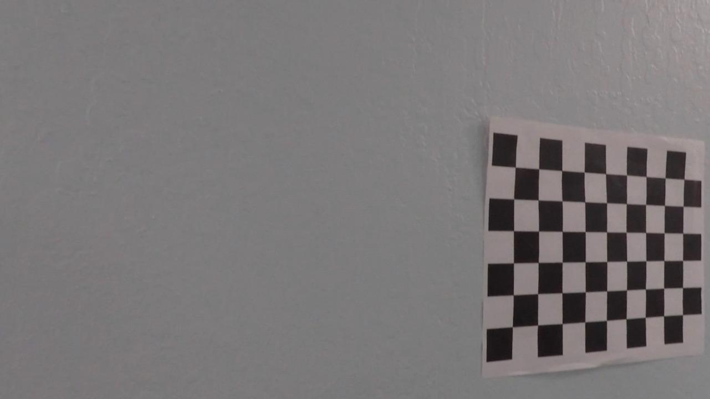
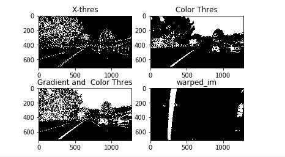

## Writeup Template

---

**Advanced Lane Finding Project**

The goals / steps of this project are the following:

* Compute the camera calibration matrix and distortion coefficients given a set of chessboard images.
* Apply a distortion correction to raw images.
* Use color transforms, gradients, etc., to create a thresholded binary image.
* Apply a perspective transform to rectify binary image ("birds-eye view").
* Detect lane pixels and fit to find the lane boundary.
* Determine the curvature of the lane and vehicle position with respect to center.
* Warp the detected lane boundaries back onto the original image.
* Output visual display of the lane boundaries and numerical estimation of lane curvature and vehicle position.

###File included in this submission
The following files have been included in this submission
* Ipython notebook with the code - P2_advanced_lane_detection.ipynb
* Folder with output image.
* Ouput video with lane lines identified
* This write up file


[//]: # (Image References)

[image1]: ./examples/undistort_output.png "Undistorted"
[image2]: ./test_images/test1.jpg "Road Transformed"
[image3]: ./examples/binary_combo_example.jpg "Binary Example"
[image4]: ./examples/warped_straight_lines.jpg "Warp Example"
[image5]: ./examples/color_fit_lines.jpg "Fit Visual"
[image6]: ./examples/example_output.jpg "Output"
[video1]: ./project_video.mp4 "Video"

## [Rubric](https://review.udacity.com/#!/rubrics/571/view) Points

### Here I will consider the rubric points individually and describe how I addressed each point in my implementation.  


### Writeup / README

#### 1. Provide a Writeup / README that includes all the rubric points and how you addressed each one. 

You can submit your writeup as markdown or pdf.  [Here](https://github.com/udacity/CarND-Advanced-Lane-Lines/blob/master/writeup_template.md) is a template writeup for this project you can use as a guide and a starting point.  

You're reading it!

### Camera Calibration

#### 1. Compute the camera calibration matrix and distortion coefficients given a set of chessboard images.

The code for this step is contained in the first code cell of the IPython notebook located in "P2_advanced_lane_detection.ipynb" (or in lines 25 through 63 of the file called `P2_advanced_lane_detection.py`).  

I start by preparing "object points", which will be the (x, y, z) coordinates of the chessboard corners in the world. Here I am assuming the chessboard is fixed on the (x, y) plane at z=0, such that the object points are the same for each calibration image.  Thus, `objp` is just a replicated array of coordinates, and `objpoints` will be appended with a copy of it every time I successfully detect all chessboard corners in a test image.  `imgpoints` will be appended with the (x, y) pixel position of each of the corners in the image plane with each successful chessboard detection.  

I then used the output `objpoints` and `imgpoints` to compute the camera calibration and distortion coefficients using the `cv2.calibrateCamera()` function.  I applied this distortion correction to the test image using the `cv2.undistort()` function and obtained this result: 

![alt text][image1]


### Pipeline (single images)

#### 1.Apply Distortion Correction to test images

The camera calibration coefficients mtx and dst were pickled (code line **74** and code line **75**) and were used in the function cv2.undistort (code line **5**) in order to remove distortion in the test images provided. Below is example of a distortion corrected image

![alt text][image2]


#### 2.  Use color transforms, gradients, etc., to create a thresholded binary image.

Combination of color and gradient thresholds were used to generate a binary image has been done according the tutorials (The code for doing various thresholding operations are in the line  **114** to **181**  and the parameters chosen for these functions are in code line **8**). The gradient thresholding using sobel operator in x-direction was more effective one. For color thresholding the s-channel is used to identify yellow and white lines better under different lightening conditions.Combination of sobelx gradient thresholding and s- color thresholds were used to obtain the thresholded binary image. Below is the result of combination of sobelx gradient thresholding and s- color thresholds operations:

![alt text][image3]


#### 3. Apply a perspective transform to rectify binary image ("birds-eye view").

After the thresholding operation, we perform the perspective transform includes a function called `perspective_transform
()` to change the image to bird's eye view. This is done because we can use this to identify the curvature of the lane and fit a polynomial to it. To perform the perspective transform, 4 src points were identified that form a trapezoid on the image and 4 dst points such that lane lines are parallel to each other after the transformation. Finally I used the cv2.getPerspective to identify M and then cv2.warpPerspective to use the M matrix to warp an image. The code for perspective_transform function is in code cell **184** 

The code for my perspective transform includes a function called `perspective_transform()`, which appears in lines 184 through 201 in the file `P2_advanced_lane_detection.py` (output_images/examples/example.py) (or, for example, in the 3rd code cell of the IPython notebook).  The `warper()` function takes as inputs an image (`img`), as well as source (`src`) and destination (`dst`) points.  I chose the hardcode the source and destination points in the following manner:

```python
src = np.float32(
    [[(img_size[0] / 2) - 55, img_size[1] / 2 + 100],
    [((img_size[0] / 6) - 10), img_size[1]],
    [(img_size[0] * 5 / 6) + 60, img_size[1]],
    [(img_size[0] / 2 + 55), img_size[1] / 2 + 100]])
dst = np.float32(
    [[(img_size[0] / 4), 0],
    [(img_size[0] / 4), img_size[1]],
    [(img_size[0] * 3 / 4), img_size[1]],
    [(img_size[0] * 3 / 4), 0]])
```

This resulted in the following source and destination points:

| Source        | Destination   | 
|:-------------:|:-------------:| 
| 300,720       | 320, 720      | 
| 1100,720      | 1100, 720     |
| 730,480       | 1100, 0       |
| 580,480       | 300, 0        |

I verified that my perspective transform was working as expected by drawing the `src` and `dst` points onto a test image and its warped counterpart to verify that the lines appear parallel in the warped image.

![alt text][image4]


#### 4. Detect lane pixels and fit to find the lane boundary.

In order to better estimate where the lane is, we use a histogram of the bottom half of image to identify potential left and right lane markings.I modified this function to narrow down the area in which left and right lanes can exist so that highway lane seperators or any other noise doesn't get identified as a lane. Once the initial left and right lane bottom points are identified, we divide the image in windows, and for each left and right window we find the mean of it, re-centering the window. We then feed the numpy polyfit function to find the best second order polynomial to represent the lanes, as in image below. The code for the fit_polynomial function is in code cell **360** 

![alt text][image5]


#### 5. Determine the curvature of the lane and vehicle position with respect to center.

The radius of curvature is given by following formula.

Radius of curvature=​​ (1 + (dy/dx)2)1.5 / abs(d2y /dx2)

We will calculate the radius of curvature for left and right lanes at the bottom of image.

x = ay2 + by + c

Taking derivatives, the formula is: radius = (1 + (2a y_eval+b)2)1.5 / abs(2a)

Also we need to convert the radius of curvature from pixels to meter. This is done by using a pixel conversion factor for x and y directions. The calculation of radius of curvature and offset from center is in code cell **536** and **537**. A sanity check suggested in the lectures was to see if calculated radius of curvature ~ 1km for the track in project video.

Calculation of offset to the center of lane.

We assume the camera is mounted exactly in the center of the car. We first calculate the bottom of left and right lane and hence the center of the lane. The difference between the center of the image (1280 /2 = 640) and the center of the lanes is the offset (in pixels). The calculation was then converted to meters.


#### 6. Plot result back down onto tho road such that the lane area is identified clearly.

Once we have lane lines identified and polynomial fit to them, we can again use cv2.warpPerspective and the Minv matrix to warp lane lines back onto original image. We also do a weightedadd to show the lane lines on the undistorted image. The code for draw lines function is in code cell **568** .  Here is an example of my result on a test image. I have used cv2.putText to display radius of curvature and offset from center on this image. The code for adding text to image is in code cell **556** :


![alt text][image6]

#### 7.Sanity Check
I also implemented a function to sanity check if the lane lines were being properly identified. This function did the following 3 checks:
* Left and right lane lines were identified (By checking if np.polyfit returned values for left and right lanes)
* If left and right lanes were identified, there average seperation is in the range 150-430 pixels
* If left and right lanes were identified then there are parallel to each other (difference in slope <0.1)

If an image fails any of the above checks, then identified lane lines are discarded and last good left and right lane values are used.
This function was particularly useful in the challenge video where it was difficult to properly identify lane lines.
The code for sanity check is in code cell **624** :

---

### Pipeline (video)

After creating all the required functions, I first tested a pipeline that combined all the functions on test images. Once I was satisfied with the results I created a process image pipeline code cell **1241** for treating a sequence of images. I added the following checks to this pipeline:
* If this is the first image then the lane lines are identified using a histogram search (checked using a counter variable)
* Otherwise the previous left and right fit are used to narrow the search window and identify lane lines (function implemented in code cell **1250**
* The left and right fits identified were stored in a variable and if sanity check described above was failed, then the last good values of left and right fit were used

Finally moviepy editor was used to process the project video image by image through the pipeline. The result was pretty good. Lane lines were identified very well through the entire video. 
Here's a [link to my project video result](./test_video.mp4)

I also tested the pipeline on the challenge video and it performed well, not as good as the project video but decent. 
Here's a [link to my challenge video result](./test_challenge_video.mp4)


### Tracking (video)

Implemented class that contains the all functions previous mentioned.Added the parameters to do tracking of the following features.

1.Whether the Line is detected or not ?
2.X values of the last n fits of the Line.
3.Average X values of the fitted Line over the last n iterations.
4.Polynomial Coeffficients averaged over the last n iterations.
5.Polynomial Coeffficients for the most recent fit.
6.Radius of curvature of the Line in meters.
7.Distance in meters of Vehicle.
8.Difference in fit coeffficients between last and new fit.
9.X values for Detected Line pixels.
10.Y alues for Detected Line pixels.

Following was implemented in the fit_polynomial() **930**, search_around_poly **990**

---

### Discussion

#### 1. Briefly discuss any problems / issues you faced in your implementation of this project.  Where will your pipeline likely fail?  What could you do to make it more robust?


In the Challenge video,  the lane detection works fine till crossing the over bridge, the program fails to continue since the next frames are unable to be fetched.

In harder challenge video, the lane detection works generally in straight road conditions but in drastactically varying curves the proposed method cannot detect the lanes at higher accuracy.

